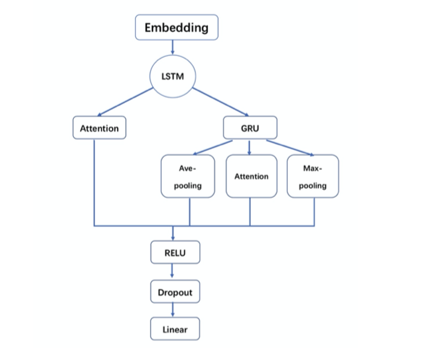
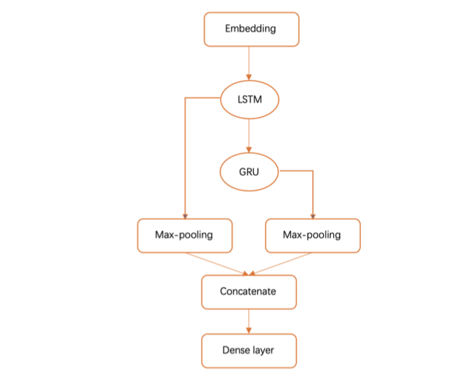
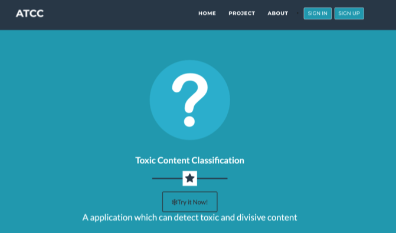
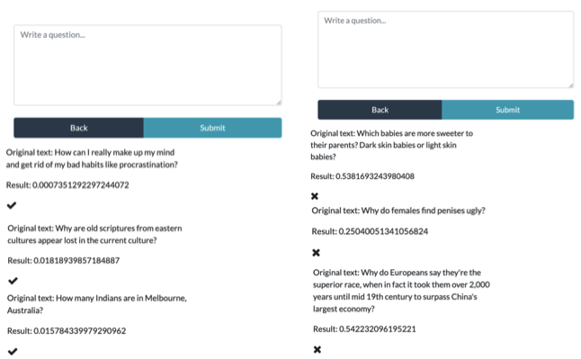

# AI-Toxic-Content-Classification-in-Django

## Table of Contents

- [Introduction](#introduction)
- [Features](#features)
- [Usage](#usage)
- [Architicture](#architicture)
- [Author](#author)
- [License](#license)

## Introduction  
We aim at finding out inappropriate comments from Quora website by building a binary classification model and apply the model to our website where you enter some questions and then the application will provide you with output to classify whether your words are TOXIC or NOT. We use word embedding method to map each text into corresponding data. Then we tried three different models and one combination method to train the model. The approaches we adopt to solve the problem are ‘GRU’, ‘LSTM’ and ’Attention’. We used the Django to build the AI application which including friendly interaction and beautiful interface. Finally, in the evaluation part, our accuracy reaches 0.70583. And the application can provide stable problem detection services.

## Usage
- [For model](https://github.com/nature1995/AI-Toxic-Content-Classification-in-Django/tree/master/Model)
- [For web application](https://github.com/nature1995/AI-Toxic-Content-Classification-in-Django/tree/master/Web)
- [For demo](https://github.com/nature1995/AI-Toxic-Content-Classification-in-Django/tree/master/Demo)
- [For paper](https://github.com/nature1995/AI-Toxic-Content-Classification-in-Django/blob/master/Toxic-Content-Classification-in-Django.pdf)

## Architicture
### Models
#### Attention model
 

#### Combination model

### Applications 
#### UI

#### Result for application

## Author

* **Ziran Gong** - [@nature1995](https://github.com/nature1995)
* **Peihong Yu** - [@PeihongY](https://github.com/PeihongY)
* **Haoran Peng** - [@PPGod95](https://github.com/PPGod95)

## License

[MIT](LICENSE) ©
